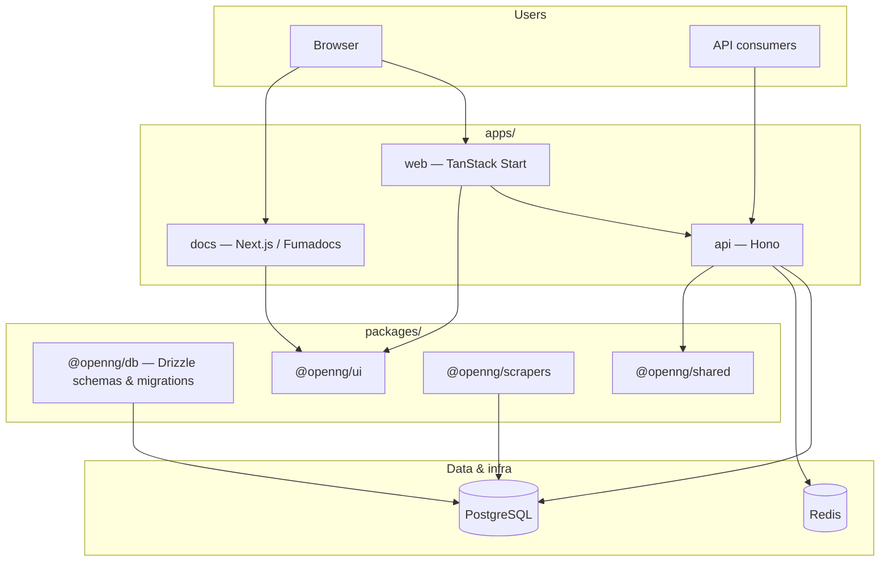
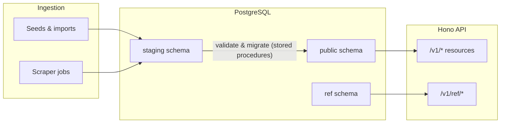

# OpenNG

OpenNG is an open-source REST API platform that makes Nigerian public data accessible to developers. Data that exists in government PDFs, broken portals, and Excel files is collected, cleaned, validated, and served through a **versioned REST API**, alongside a **web app** for exploration and a **documentation site**.

Planned production surfaces:

| Surface | Role |
| ------- | ---- |
| **API** | Versioned JSON REST API (`api.openng.dev`) |
| **Web** | Landing page, data explorer, dashboard, contribution flows (`openng.dev`) |
| **Docs** | Product and API documentation (`docs.openng.dev`) |

Repository: [github.com/stephcrown/openng](https://github.com/stephcrown/openng)

## Tech stack

| Layer | Technology |
| ----- | ---------- |
| Language | TypeScript (strict) |
| Runtime | Node.js 22+ |
| Monorepo | pnpm workspaces, Turborepo |
| API | Hono on Node.js |
| Web | TanStack Start (Vite, TanStack Router, React) |
| Documentation | Next.js App Router, Fumadocs |
| ORM | Drizzle |
| Database | PostgreSQL 16 (multiple schemas: `public`, `staging`, `ref`, `analytics`) |
| Validation | Zod |
| Cache / rate limiting | Redis |
| CI | GitHub Actions |

Shared packages use the `@openng/` scope (`@openng/db`, `@openng/shared`, `@openng/ui`, `@openng/scrapers`, plus internal ESLint and TypeScript config packages).

## Architecture

High-level monorepo and runtime relationships:



How data moves from sources to the API (staging pipeline and production reads):



## Getting started

### Prerequisites

- [Node.js](https://nodejs.org/) 22 or newer (see root `engines` and `.nvmrc` if present)
- [pnpm](https://pnpm.io/) (workspace pins `packageManager` in root `package.json`)
- [Docker](https://docs.docker.com/get-docker/) for local PostgreSQL, Redis, and observability stack (`docker compose`)

### 1. Install dependencies

From the repository root:

```sh
pnpm install
```

### 2. Environment variables

Copy the example env files and fill in secrets where needed:

```sh
cp .env.example .env
cp apps/api/.env.example apps/api/.env
cp apps/web/.env.example apps/web/.env
```

Generate secrets as described in `.env.example` (for example `openssl rand -hex 32` for `SESSION_SECRET` and `MAGIC_LINK_SECRET`). Root `.env.example` documents database URLs aligned with Docker Compose ports.

### 3. Start infrastructure

Postgres and Redis (and related services) run in Docker; apps run on the host in development:

```sh
docker compose up -d
```

### 4. Database migrations

With `DATABASE_URL` set (see root `.env`), apply schema migrations from `@openng/db`:

```sh
pnpm --filter @openng/db db:migrate
```

### 5. Run the apps

Start all packages in watch mode:

```sh
pnpm dev
```

Or target one app:

```sh
pnpm exec turbo dev --filter=api
pnpm exec turbo dev --filter=web
pnpm exec turbo dev --filter=docs
```

Default local ports:

| App | Port |
| --- | ---- |
| API (`apps/api`) | [http://localhost:3000](http://localhost:3000) |
| Web (`apps/web`) | [http://localhost:3001](http://localhost:3001) |
| Docs (`apps/docs`) | [http://localhost:3002](http://localhost:3002) |

### Tests and quality

```sh
pnpm test
pnpm lint
pnpm check-types
```

API tests use a separate database when configured; see `apps/api/.env.test.example`.

## Project layout (overview)

```
openng/
├── apps/
│   ├── api/          # Hono REST API
│   ├── web/          # TanStack Start frontend
│   └── docs/         # Fumadocs documentation site
├── packages/
│   ├── db/           # Drizzle schema and migrations
│   ├── shared/       # Shared types and helpers
│   ├── scrapers/     # Data acquisition jobs
│   └── ui/           # Shared UI primitives and tokens
├── scripts/          # Import, validate, migrate CLIs
├── data/seeds/       # Versioned seed data (where applicable)
└── docker-compose.yml
```

---

Contributions welcome via issues and pull requests on GitHub.
